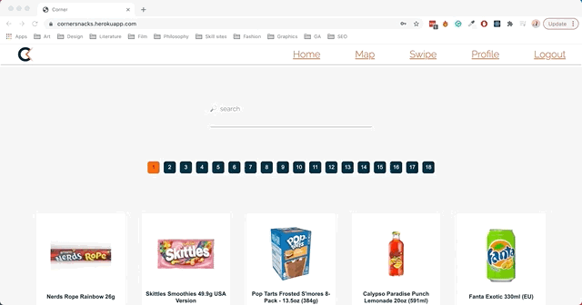
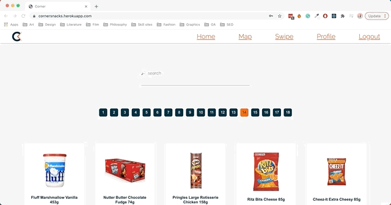
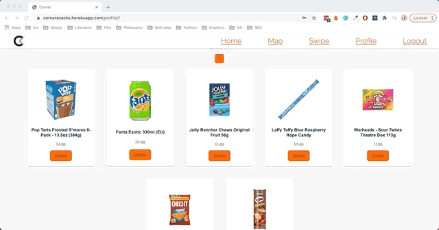
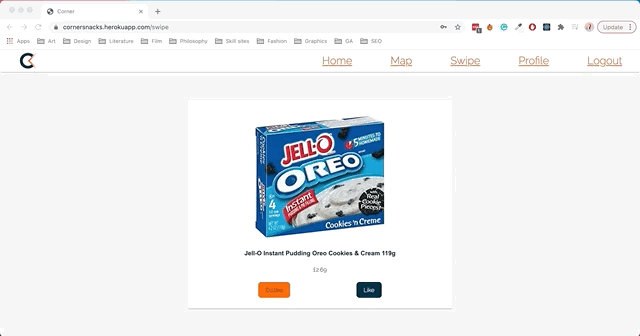
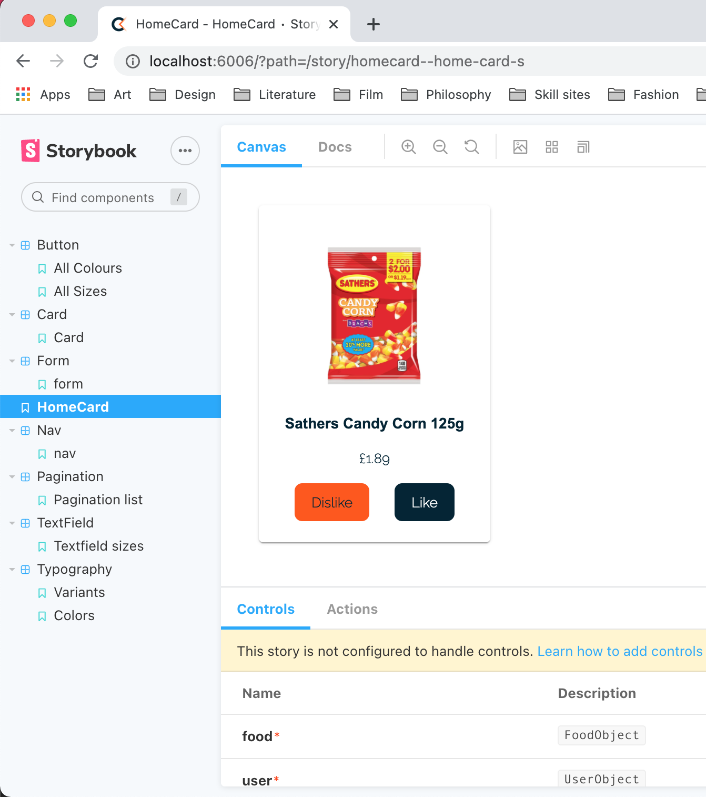

# 

<h1>Freelance Project: Corner</h1>
 
<h2>Problem: People want more say in what their local store’s supply, local stores want better research on this.</h2>
 
<h2>Solution: Build a web app that allows users to vote on food goods for their local area, and allow local stores to access this data.</h2>
 
| Contents                      |                                |
| ----------------------------- | ------------------------------ |
| 1. [Overview](#overview)      | 6. [Future content](#future)   |
| 2. [Brief](#brief)            | 7. [Wins](#wins)               |
| 3. [Technologies used](#tech) | 8. [Blockers](#blockers)       |
| 4. [App](#app)                | 9. [Bugs](#bugs)               |
| 5. [Approach](#approach)      | 10. [Future learnings](#learn) |
 
<h2 name='overview'>Overview</h2>
 
<h3>Introduction</h3>
 
I recognised that there was a need to improve the way people voiced their desires
for food goods. We believe this could help local stores increase their sales while catering to areas
that wanted different foods such as carbon balanced foods.
 
<h3>Deployment</h3>
 
The app is deployed on Heroku and can be found here: https://cornersnacks.herokuapp.com/ <br> The login
details are username: James password: zuF22GXCG1cy <br>

<h2 name='brief'>Brief</h2>
 
- **Build a voting system** Create a web app that allows users to vote on certain foods and local
 stores to see this
- **Have a map** The map should display the votes for foods in area codes
- **Have a simple design**
- **Be deployed online**
 
<h2 name='tech'>Technologies used and why?</h2>
 
<strong>TypeScript</strong> because it stops simple bugs creeping in, speeding up development<br>
<strong>Storybook</strong> because it's easy to check, test and share UI components with my colleague<br>
<strong>Redux</strong> because it allows me to make one request for the user meaning it is faster<br>
<strong>Atomic Design</strong> because it makes my project easier to manage, keep brand consistency,
and bring on other engineers, later on, <br>
<strong>Django</strong> because it is quick and easy to set up with and has pre-built features I can use<br>

<h2 name='app'>App</h2>

The user will be able to search all items by name, and then either dislike or like those items.<br> <br> <br>  <br> <br> <br>
The user will also be able to search through the lists of items using pagination.<br> <br> <br>  <br> <br> <br>
The user will be able to search their profile for their likes and dislikes.<br> <br> <br>
 <br> <br> <br>
The user will be able to change their likes on their profile. The item will not switch to the other list as I want the user to see what they liked and to be able to change their mind.<br> <br> <br>  <br> <br> <br>
The user can view total likes on a map, the map shows users areas and the likes and dislikes of that area.<br> <br> <br>
<br> <br> <br>
The user can randomly like or dislike items using the swipe feature.<br> <br> <br>


<h2 name='approach'>Approach</h2>
My approach was to build the front end with atomic design, that is building the components before. This is a very slow process to begin with. However it is very scalable and easy to use when working with other Engineers. TypeScript mean't I can force the person building with the pre built components to use a certain set of props meaning everything is kept on brand.
I used Test Driven Development with a django backend to increase speed and make sure I'm working to my original specifications.
<br>
<br>
<h2 name='future'>Future content</h2>
<h3>A shops feature</h3>
Allow shops to make a profile and show their contents<br>
<br>
<br>
<h2 name='wins'>Wins</h2>
<h3>Storybook</h3>
Using storybook to check my components and share with other stakeholders was a great thing to use. Making changes much easier and quicker
<br> <br> <br> 
<br>
<br>
<h3>TypeScript</h3>
TypeScript was a new language for me and understanding and getting to grips with types was really useful and interesting to me.
<br>
<br>

    function hasKey<O>(error: O, elName: keyof any): elName is keyof O {
        return elName in error
    }

    const getErrorMessage = (error: ErrorObject, elName: string) => {
    if (hasKey(error, elName)) {
    if (error[elName]) {
    isError = true
    return error[elName]
    }
    }
    return null
    }
    ```

<br>
<br>

<h2 name='blockers'>Blockers</h2>
<h3>Sets</h3>
TypeScript doesn't yet allow for sets.
<br>
<br>
<h3>Design</h3>
Using atomic design mean't I found it a lot harder to make the app look good. This was because I didn't have the time I needed to intergrate the elements properly.
<br>
<br>
<h2 name='bugs'>Bugs</h2>
<h3>Geolocation</h3>
Mapping users areacodes onto the map sometimes caused an error if the google API I was using couldn't find the areacode. I need to find a better API for this<br>
<br>
<br>
<h2 name='learn'>Future learnings</h2>
• Use TypeScript type assertions.<br>
```
